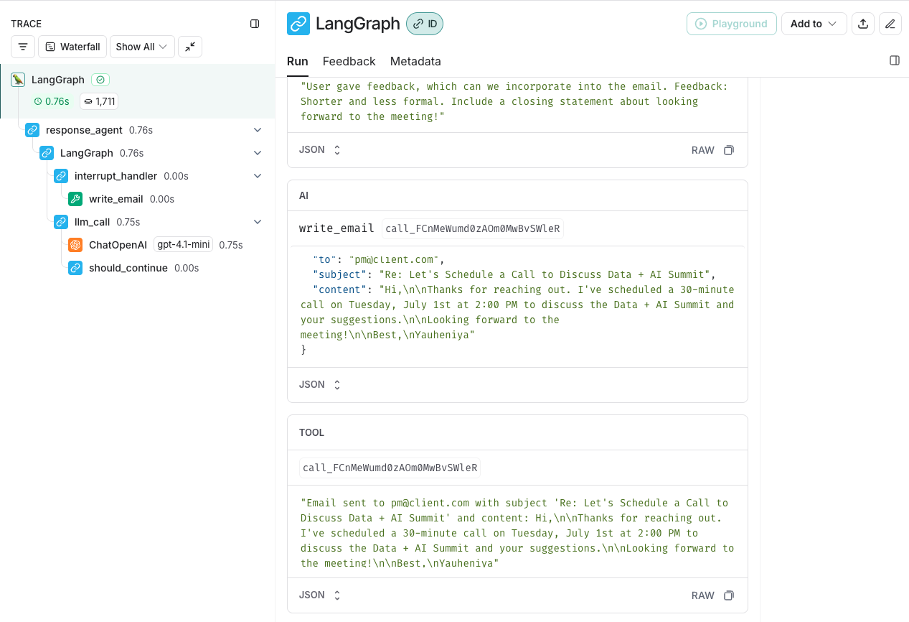

# AI Email Agent

The repo is a guide to building an email agent with LangGraph. It builds up to an [ambient agent](https://blog.langchain.dev/introducing-ambient-agents/) that can manage your email with connection to the Gmail API. It includes agent evaluation, human-in-the-loop, and memory. 

## Environment Setup 

### Create Virtual Environment and Install Packages
**Recommended: Using [uv](https://docs.astral.sh/uv/getting-started/installation/) (faster and more reliable)**
```shell
# Install the package with development dependencies
uv venv --python=3.12

# Activate the virtual environment (macOS/Linux)
source .venv/bin/activate

# Install packages
uv pip install -r requirements.txt

# Install the project in editable mode by locating setup.py for development purposes
uv pip install -e .
```

### API Keys

* If you don't have an OpenAI API key, you can sign up [here](https://openai.com/index/openai-api/).
* Sign up for LangSmith [here](https://smith.langchain.com/). Generate a free LangSmith API key.

### Set Environment Variables

* Create a `.env` file in the root directory:
```shell
# Copy the .env.example file to .env
cp .env.example .env
```

* Edit the `.env` file with the following:
```shell
LANGSMITH_API_KEY=your_langsmith_api_key
LANGSMITH_TRACING=true
LANGSMITH_PROJECT="interrupt-workshop"
OPENAI_API_KEY=your_openai_api_key
```


## Usage
The main notebook is located in ./notebooks/email-agent.ipynb

### Monitoring in LangSmith


## Connecting to Gmail APIs  

The notebook uses mock email and calendar tools. 

### Gmail Integration and Deployment

Set up Google API credentials following the instructions in [Gmail Tools README](src/email_assistant/tools/gmail/README.md).

The README also explains how to deploy the graph to LangGraph Platform.

The full implementation of the Gmail integration is in [src/email_assistant/email_assistant_hitl_memory_gmail.py](/src/email_assistant/email_assistant_hitl_memory_gmail.py).


## References

LangChain Academy: [Building Ambient Agents with LangGraph](https://academy.langchain.com/courses/ambient-agents)


